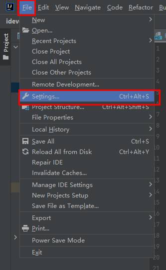
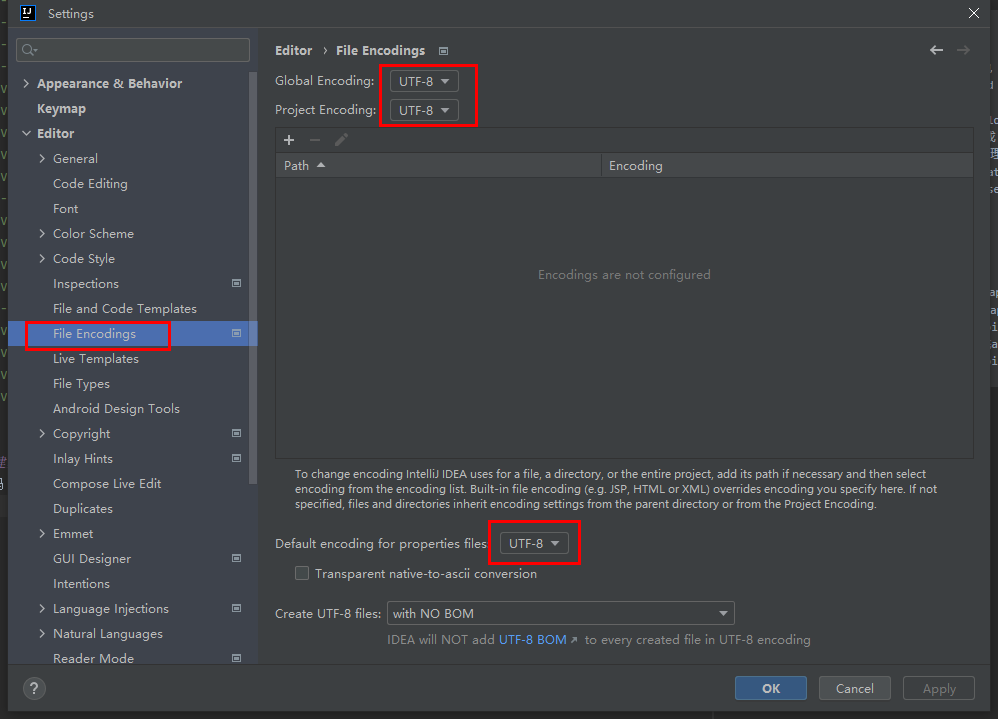
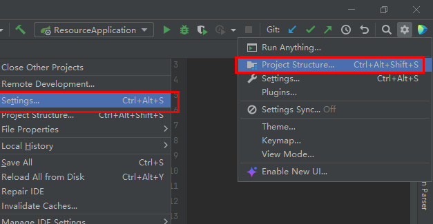
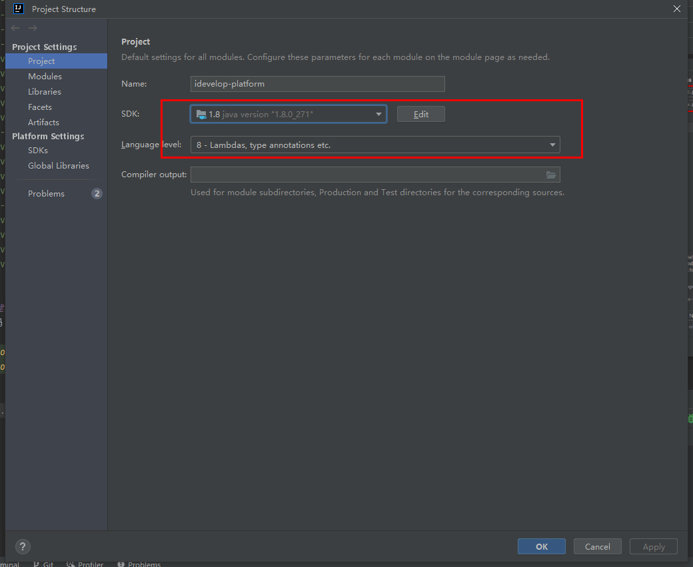
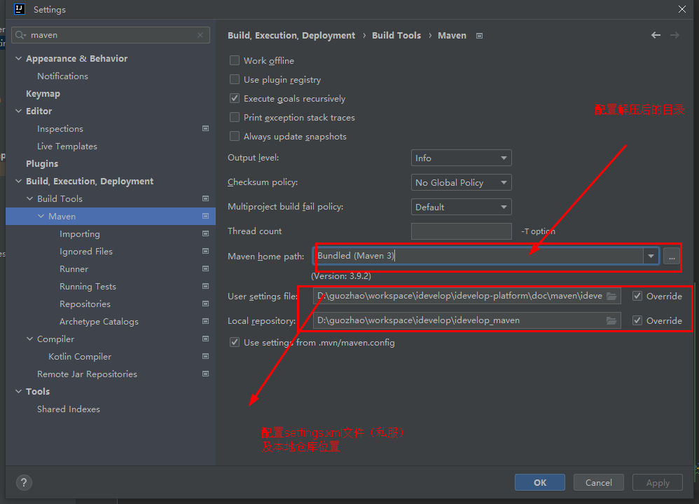
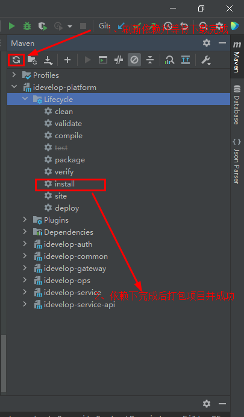
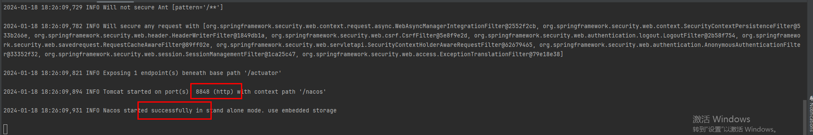
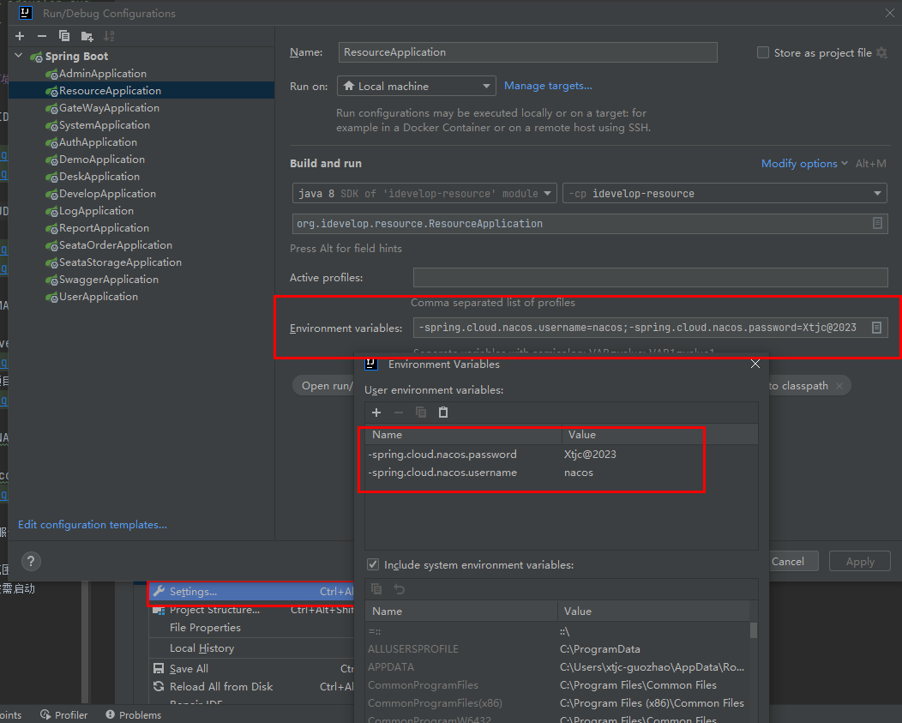

## 一、工程结构
``` 
idevelop-platform
├── idevelop-auth -- 授权服务提供
├── idevelop-common -- 常用工具封装包
├── idevelop-gateway -- Spring Cloud 网关
├── idevelop-ops -- 运维中心
├    ├── idevelop-admin -- spring-cloud后台管理
├    ├── idevelop-develop -- 代码生成
├    ├── idevelop-resource -- 资源管理
├    ├── idevelop-seata-order -- seata分布式事务demo
├    ├── idevelop-seata-storage -- seata分布式事务demo
├── idevelop-service -- 业务模块
├    ├── idevelop-cmdb -- cmdb模块 
├    ├── idevelop-desk -- 工作台模块 
├    ├── idevelop-data -- 数据集成模块 
├    ├── idevelop-device -- 设备管理模块 
├    ├── idevelop-endpoint -- 数据共享模块 
├    ├── idevelop-log -- 日志模块 
├    ├── idevelop-system -- 系统模块 
├    └── idevelop-user -- 用户模块 
├── idevelop-service-api -- 业务模块api封装
├    ├── idevelop-cmdb-api -- cmdbapi 
├    ├── idevelop-desk-api -- 工作台api 
├    ├── idevelop-device-api -- 设备api 
├    ├── idevelop-dict-api -- 字典api 
├    ├── idevelop-endpoint-api -- 数据共享服务api 
├    ├── idevelop-system-api -- 系统api 
└──  └── idevelop-user-api -- 用户api 
```

## 二、研发环境搭建步骤

### **1.配置IDEA编码**




### **2.配置JDK1.8**




### **3.配置MAVEN**

在doc/maven目录下找到[apache-maven-3.3.9-bin.zip](doc%2Fmaven%2Fapache-maven-3.3.9-bin.zip)及配置文件[idevelop-settings.xml](doc%2Fmaven%2Fidevelop-settings.xml)

然后刷新项目下载依赖包


### **4.启动NACOS**

在doc/nacos目录下找到[nacos-server-2.1.2](doc%2Fnacos%2Fnacos-server-2.1.2)，在bin目录下执行startup.cmd，启动nacos服务端


**5.启动服务**

最小启动范围包含：idevelop-auth、idevelop-gateway、idevelop-system、idevelop-user
其他服务按需启动


## 三、平台开发手册

### **1.枚举项**

```text
1.命名规范: 请按照 xxxEnum 格式进行新增, 如 WorkOrderTypeEnum.
2.开发规则: 请实现 com.lnsoft.common.enums.IEnum 类.
3.包路径: 新增枚举类放于: com.lnsoft.common 包下.
```

### **2.Mysql**

```text
1.新增表: 请按照 idevelop_xxx 格式进行新增. 如 idevelop_approve_record
```

### 